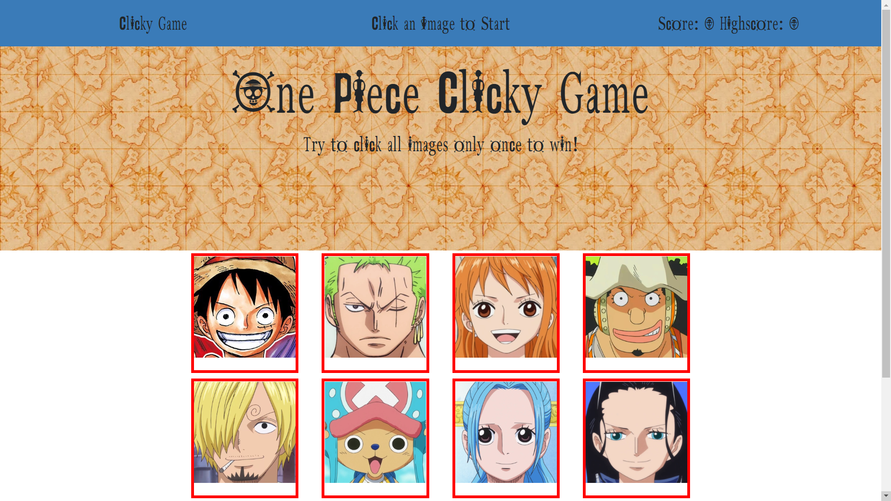

# clicky-game

A very simple react site to play a very clicky game. The one goal of the game is to click on every picture only once. If a user clicks correctly or incorrectly they are notified in the center of the navbar and their score/highscore are updated. Every time the user clicks on an image they all shuffle randomly.

# Link to Github
[Clicky-Game](https://github.com/JakeDudum/clicky-game)

# Link to Deployed Site (Github Pages)
[Github](https://jakedudum.github.io/clicky-game/)

# Built With
- [HTML](https://developer.mozilla.org/en-US/docs/Learn/HTML)
- [CSS](https://developer.mozilla.org/en-US/docs/Web/CSS)
- [Javascript](https://developer.mozilla.org/en-US/docs/Web/JavaScript)
- [JSX](https://reactjs.org/docs/introducing-jsx.html)
- [React](https://reactjs.org/)

# Versioning
- [Github](https://github.com/)

# Authors
### Jake Dudum
